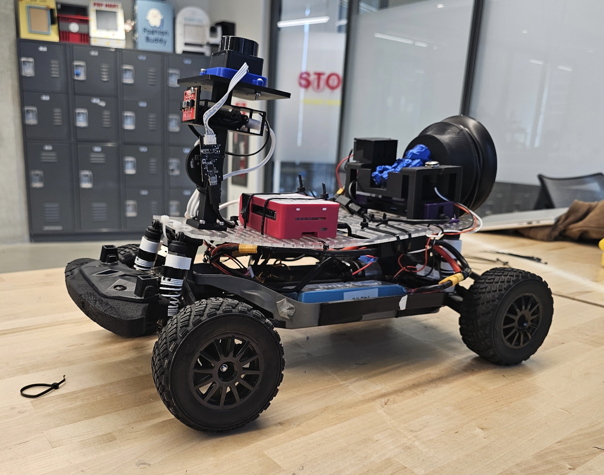
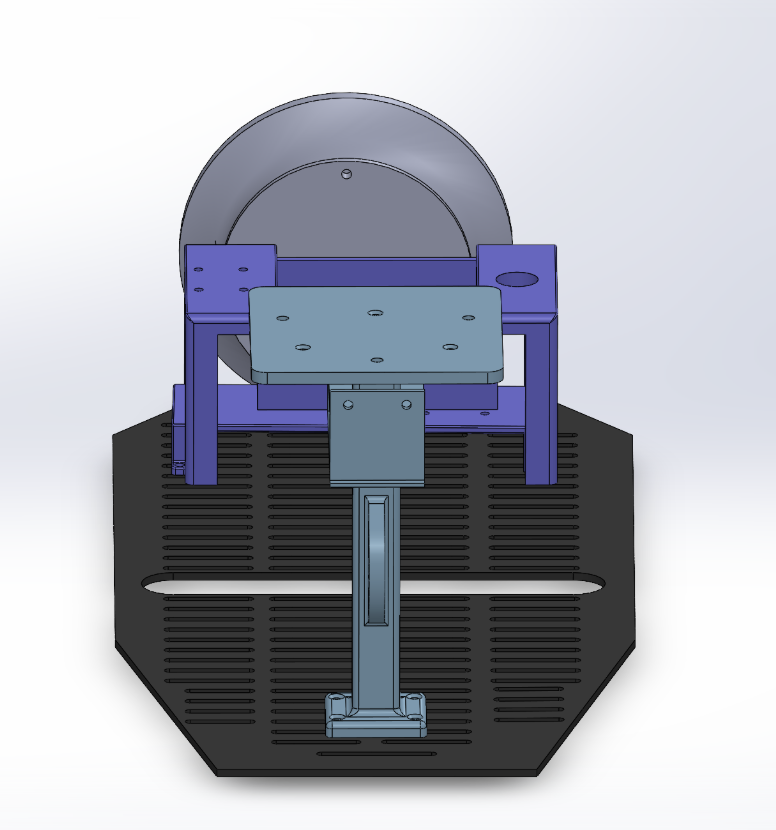
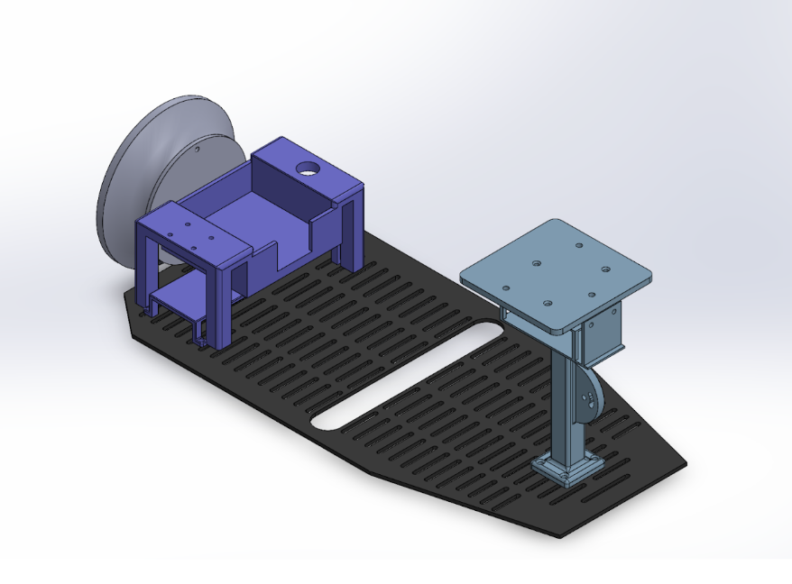
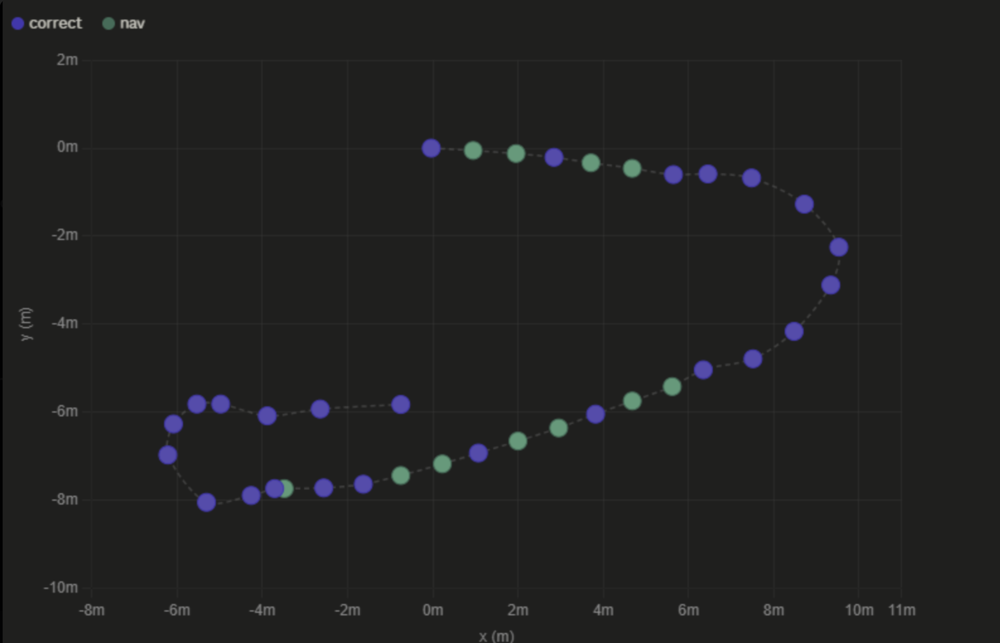
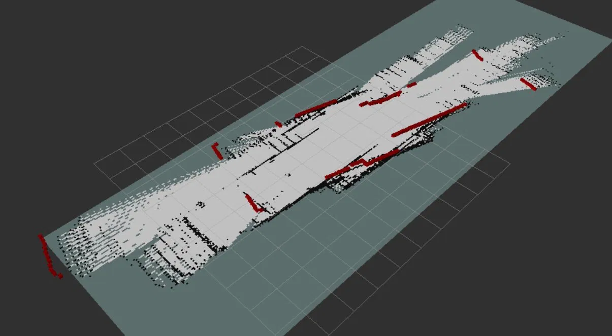
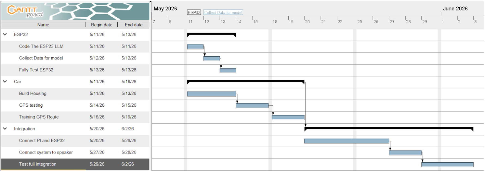
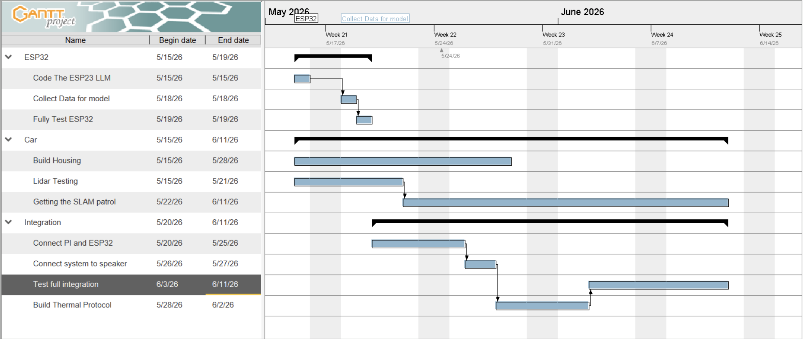

# UCSD ECE/MAE 148 Team 6 Final Project 


# Doom Patrol: An Autonomous Security Guard 


## Table of Contents

1. [Team Members](#team-members)
2. [Project Overview](#project-overview)
3. [Goals](#goals)
4. [Robot Hardware](#robot-hardware)
5. [Mechanical Design](#mechanical-design)
6. [Accomplishments](#accomplishments)
7. [Lessons Learned](#lessons-learned)
8. [Next Steps](#next-steps)
9. [Gantt Chart](#gantt-chart)
10. [Videos and Resources](#videos-and-resources)
11. [Project Reconstruction](#project-reconstruction)


## Team Members: 

| Name | Major | Year |
|---------------------|---------------------|---------------------|
| Ahnaf H. | Mechanical Engineering| 2027 |
| Daniel G. | Computer Engineering | 2026 |
| Tracy T. | Mechanical Engineering | 2027 |
| Vincent S. | Computer Engineering | 2029 |

## Project Overview 
Thermal Patrol is an autonomous indoor security robot built ontop of UCSD's robocar platoform. The robot patrols a hallway using LiDAR based closed loop PID control, detects people using a thermal camera and triggers an alarm in response. 

## Goals 

### Original Goals
- Connect an ESP-32 based thermal camera with a Raspberri Pi using ROS2
- Detect people using the thermal camera, stop, and sound the alarm 
- Autonomously patrol hallways and avoid obsticles using a LiDAR

### Goals We Met 
- ESP-32 thermal camera integrated with ROS2 via a MQTT bridge
- LiDAR based hallway patroling 
- Obsticle detection and avoidance 
- Heat signature detection using a ML model running on the ESP-32
- Got SLAM to map a hallway although inconsistently

### Stretch Goals 
- full SLAM based mapping and autonomous navigation with waypoints 
- Web application to notify the user of an intruder 
- YOLO model integration to verify if a heat signature is infact a person 


## Robot Hardware 
| Component | Description |
|---------------------|---------------------|
| LD19 LiDAR | Used for autonomous navigation including obsticle avoidance and SLAM mapping |
| Thermal Camera | Low resolution thermal sensor used for detecting human heat signatures |
| ESP-32 | Reads thermal camera data, runs a custom ML model and publishes the results over MQTT |
| Raspberry Pi | Our main computer running ROS2 Jazzy |

## Mechanical Design 

<p float="left">
  
  
</p>


## Accomplishments 

### Thermal Detection & MQTT
- An ESP-32 reads ther thermal camera's measurments and runs an on device ML model to detect heat signatures 
- The ESP-32 publishes detections over MQTT through WiFi, allows for the reuse and scaling of the thermal detection module 
- A ROS2 bridge node subscribes to the ESP-32's MQTT topic and converts that signal into standard ROS2 topics 

### Autonomous Navigation 
#### PID Based Hallway Centering 
- Our LD19 LiDAR measures the distance from the left and right wall 
- The controller averages the two measurments to determine the center of the hallway 
- Using closed loop PID control the car continously aims for the center of the hallway 

#### Obsticle Avoidance 
- LiDAR detects objects infront of the robot 
- The system checks left and right to check for obsticles and turns in the aproriate direction 
- The robot waits until the path infront of it is clear again before turning back and returning to its original path 

#### SLAM Mapping 
- Got SLAM mapping to work but had trouble with odometry drift and issues pattern matching in a symetrical hallway 

## Challenges & Solutions

| System | Challenge | Solution |
|---|---|---|
| GPS | Unreliable signal and inaccurate readings due to a lack of corrections | Determined it was a hardware issue and pivoted to an indoor LiDAR based solution |
| Odometry | Significant drift in odometry readings made it unreliable and impacted SLAM mapping | Relied more heavily on LiDAR and implemented closed loop control based on LiDAR measurements |
| SLAM | Generated noisy and inconsistent maps; unable to consistently map a symmetrical hallway | Tried filtering out bad poses; next step would be RTAB-Map with an OAK-D camera for visual anchors |


<table align="center" width="90%">
  <tr>
    <td align="center"></td>
    <td align="center"></td>
  </tr>
  <tr>
    <td align="center">Display of odometry drift: red dots are the actual percived path and purple is our actual odometry data</td>
    <td align="center">Display of our SLAM map faliures:
     1. The mapping becomes off at an angle due to odometry drift 
     2. The end of the map shifts due to the symetry and difficulties pattern matching in that cast</td>
  </tr>
</table>

## Lessons Learned 
- **Start early and test frequently:** hardware and software issues come up frequently even the smallest things break
- **Expect things to break:** leave time for debugging and unexpected faliures 
- **Research before committing to a solution:** the SLAM toolbox was a reaonable initial choice but RTAB mapping would have better fitted for mapping symmetric hallways from the start. 
- **Pivot decisively:** when we were unable to get our GPS working after about a week pivoting to an indoor solution was the right call inorder to get things up and running. 

## Next Steps
If we had one more week we would have implemented... 

+ RTAB Mapping: 
    + Combine our existing LiDAR with an OAK-D camera to improve mapping in symmetrical hallways using visual landmarks 
    + Corrects for drift and current SLAM failure modes 
+ Web Application: 
    + Send notifications to users to create a more active autonomous ‘security guard’
    + Allow them to use the web app to control the robot, draw maps, start patrol ect 
+ Higher Resolution Thermal Camera:
    + Our current thermal camera has very low resolution allowing for misidentification of objects or animals as people
+ YOLO Model Verification: 
    + Add a camera and light to run a YOLO model to detect to verify that an object is infact a person and send a notification to the user 
 

## Gantt Chart 

<table>
  <tr>
    <td></td>
    <td></td>
  </tr>
  <tr>
    <td align="center">Origional Gantt Chart</td>
    <td align="center">New Gantt Chart</td>
  </tr>
</table>

**Challenges & Changes :** 
- Around Week 8 or so we decided that it was necessary to expand the scope of our project from using GPS to LiDAR for indoor navigation. 
- We spent a lot more time debugging and had far more hardware issues than we thought for example debugging the ROS2 laps. 
- SLAM localization proved much harder to implement that we expected and forced us to focus on more alternative options. 

## Videos and Resources 

[Obsticle Avoidance](https://youtube.com/shorts/Ne7ax94jiF0?si=FTmq4ty8AiIL6D_a)

[Detecting a Heat Signature](https://youtube.com/shorts/zQ_pmDfTHU4?si=xNAbVGE-Ol0OvEGU) 
(This video was fillmed before obsticle avoidance was fully implemented hence why it stops for the cone instead of going around it)

[Final Presentation](Assets/ECE%20148%20Final%20Project%20Presentation.pdf)

## Project Reconstruction 

Here are a few steps on how to recreate our project: 

### Hardware Requirments: 
- Raspberry Pi (running UCSD Robocar Framework)
- ESP32-S3
- Qwiic GRID-Eye Infrared Array (AMG88xx)
- LD-19 LiDAR sensor


### Prerequisite: UCSD Robocar Setup

Follow the full guide [UCSD RoboCar Setup Guide](https://ucsd-ecemae-148.github.io/Markdown-Instructions/index.html)

**Step 1: SSH into your Raspberry Pi**

```bash
ssh -Y pi@ucsdrobocar-148-XX.local
```
> Use `-Y` X11 forwarding as it is required for GUI tools to display on your laptop.

**Step 2: Install Docker and pull the Robocar image**

Follow Sections 01–02 of the framework guide. Once Docker is installed:
```bash
docker pull ghcr.io/ucsd-ecemae-148/ucsd_robocar:stable
```

**Step 3: Add the Docker run function to your Pi's `~/.bashrc`**
**Step 3: Add the Docker run function to your Pi's `~/.bashrc`**
```bash
robocar_docker() {
  docker run \
    --name MY_CONTAINER_NAME \
    -it \
    --privileged \
    --net=host \
    -e DISPLAY=$DISPLAY \
    -e ROS_DOMAIN_ID=YOUR_TEAM_NUMBER \
    --volume /dev/bus/usb:/dev/bus/usb \
    --device-cgroup-rule='c 189:* rmw' \
    --device /dev/video0 \
    --volume="$HOME/.Xauthority:/root/.Xauthority:rw" \
    --volume /etc/passwd:/etc/passwd:ro \
    --volume /etc/group:/etc/group:ro \
    ghcr.io/ucsd-ecemae-148/ucsd_robocar:stable
}
```
Then reload and launch:
```bash
source ~/.bashrc
robocar_docker MY_CONTAINER_NAME
```

**Step 4:**
For all future sessions use these steps to start and enter the container
```bash
docker start MY_CONTAINER_NAME
docker exec -it MY_CONTAINER_NAME bash
source_ros2
```

Then finish the steps in the instructions linked above. 
>For more details on setting up the UCSD robocar framework please refer to this [link](https://ucsd-ecemae-148.github.io/Markdown-Instructions/index.html) 

**Step 6: Set device permissions**
Specific to our project, you must set the following device permissiions: 

```bash
sudo chmod 777 /dev/ttyACM0
sudo chmod 777 /dev/ttyUSB0
sudo chmod 777 /dev/ttyUSB1
sudo chmod 777 /dev/input/js0
```


## Getting The Car Running:

### Part 2: LiDAR Verification

Before running the patrol system verify that the LiDAR is running and publishing correctly. 

**Step 1: Confirm the LiDAR is detected**
```bash
dmesg | grep usb
```
The LD19P should appear as a USB device.

**Step 2: Configure `node_config.yaml`**
```bash
nano /home/projects/ros2_ws/src/ucsd_robocar_hub2/ucsd_robocar_nav2_pkg/config/node_config.yaml
```
Set the following:
```yaml
sub_lidar_launch: 1       # Enable LiDAR
camera_nav: 0             # Disable lane following
sensor_visualization: 1   # Enable for verification
```


**Step 3: Build and launch**
```bash
build_ros2
ros2 launch ucsd_robocar_nav2_pkg all_nodes.launch.py
```

**Step 4: In a new terminal, verify scan data is publishing**
```bash
docker exec -it MY_CONTAINER_NAME bash
source_ros2
ros2 topic echo /scan
```
You should see a continuous stream of range measurements. If nothing appears:
- Confirm `sub_lidar_launch: 1` in `node_config.yaml`
- Re-run `sudo chmod 777 /dev/ttyACM0` and retry
If it still does not work you may have a hardware issue, one quick check you can do is to verify that you LiDAR is spinning by looking at the rotating blue lights on the top of the LD19 LiDAR. 

Once you recive updates from your LiDAR move on to part 3. 

### Part 3: Clone and Build the Patrol System

**Step 1: Clone this repository**
```bash
cd /home/projects/ros2_ws/src
git clone https://github.com/UCSD-ECEMAE-148/spring-2026-final-project-team-6.git
```
**Step 2: Build the workspace**
```bash
build_ros2
```

**Step 3: Launch the full patrol system**
```bash
ros2 launch ucsd_robocar_nav2_pkg all_nodes.launch.py
```

The robot will begin patrolling using PID control and should aim for the center of a hallway and also avoid obsticles autonomously.

---

### Part 4: ESP32 Thermal Sensor Setup

The ESP32 runs an on-device ML model using the thermal sensor to detect heat signatures and communicates with the patrol system over MQTT.

**Hardware Required:**
- ESP32-S3
- Qwiic GRID-Eye Infrared Array (AMG88xx)

**Software Required:**
- VS Code with the [PlatformIO](https://platformio.org/) extension

<br>

**Step 1: Open the ESP32 code**

Clone this repository on your local machine and open the `esp32/` folder in VS Code using the PlatformIO extension.

```bash
git clone https://github.com/UCSD-ECEMAE-148/spring-2026-final-project-team-6.git
```

**Step 2: Configure your environment**

Create a `.env` file in the `esp32/` folder:
```bash
nano esp32/.env
```
Then paste in the following and fill in the blanks 
```
UCSD_USERNAME=
UCSD_PASSWORD=
# UCSDProtected switched to 5GHz and no longer works — use a non-enterprise network instead
WIFI_SSID=
NON_ENTERPRISE_WIFI_PASSWORD=
# Note: if your password contains a #, enclose it in single or double quotes
MQTT_BROKER=broker.emqx.io
MQTT_CLIENT_ID=camera
MQTT_TOPIC=robocar
```

**Step 3: Flash the ESP32**

Connect your ESP32-S3 and flash using PlatformIO's upload button in VS Code. For more details see the [PlatformIO ESP32 Upload Documentation](https://docs.platformio.org/en/stable/platforms/espressif32.html).


| Problem | Fix |
|---|---|
| Device permissions denied | Re-run `sudo chmod 777` on all `/dev/tty*` and `/dev/input/js0` after every reboot |
| LiDAR scan not appearing | Check `sub_lidar_launch: 1` in `node_config.yaml` and re-run permissions, verify the LiDAR is spinning |
| YAML changes have no effect | Always run `build_ros2` after any config change — `source_ros2` alone is not enough |
| Receiving another team's data | Verify `ROS_DOMAIN_ID` matches your team number with `echo $ROS_DOMAIN_ID` inside Docker |
| ESP32 not communicating | Ensure ESP32 and Raspberry Pi are on the same WiFi network |
| GUI windows not appearing | Reconnect SSH with `-Y` flag: `ssh -Y pi@ucsdrobocar-148-XX.local` |

---

